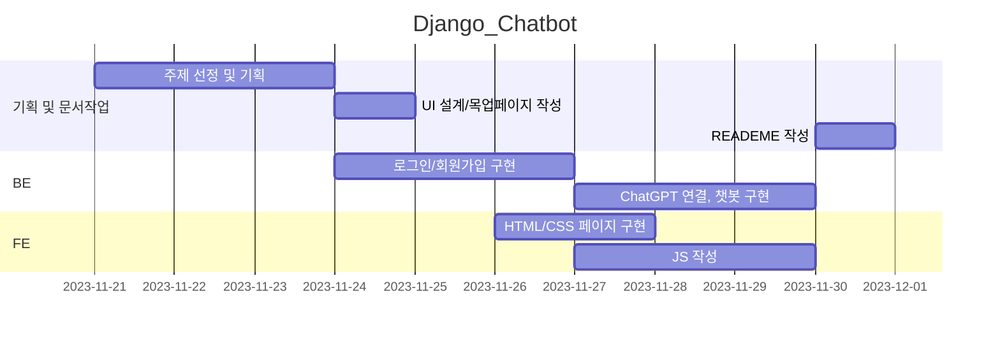

# Django_Chatbot
## AboutME
입력한 조건에 맞게 자기소개서를 작성해주는 서비스입니다

## 목차
[1. 목표와 기능](#1-목표와-기능)<br>
[2. 개발 기술 및 환경](#2-개발-기술-및-환경)<br>
[3. 요구사항 명세와 기능 명세](#3-요구사항-명세와-기능-명세)<br>
[4. 프로젝트 구조와 개발 일정](#4-프로젝트-구조와-개발-일정)<br>
[5. 데이터베이스 모델링(ERD)](#5-데이터베이스-모델링erd)<br>
[6.UI](#6-ui)<br>
[7. 기능](#7-기능)<br>
[8. 개발하며 느낀 점](#8-개발하며-느낀-점)<br>

## 1. 목표와 기능
 ### 1-1. 목표
 - 사용자가 입력한 조건에 맞게 자기소개서를 작성해주는 서비스
 ### 1-2. 기능
 - 회원가입, 로그인, 로그아웃
 - ChatGPT를 이용한 자기소개서 작성
 - ChatGPT와의 채팅

## 2. 개발 기술 및 환경
 ### 2-1. 개발 기술

[FE]
<div>
     
     
     
</div>

[BE]
 <div>
     
    
</div>

 ### 2-2. 개발 환경
 <div>
     
    
</div>

## 3. 요구사항 명세와 기능 명세
### 3.1 기본 요구사항
- DRF를 이용하여 구현
- 로그인, 회원가입 기능 구현
- 기본적인 CRUD
- ChatGPT로 요청 보내주는 API를 Django 내에 구현
- 챗봇 API는 로그인을 한 유저만 사용가능
- 각 user 당 하루 5번만 요청 가능
- 저장된 채팅 내역 본인만 조회 가능
- AWS 배포
- URL 연결

### 3.2 권장 요구사항
- 개인 도메인 등록, 프론트엔드, 백엔드 배포
- kakao, github 등 OAuth2 연결


## 4. 프로젝트 구조와 개발 일정
 ### 4-1. 프로젝트 구조

 ```
 📦Django_Chatbot_BE
 ┣ 📂AboutMe
 ┃ ┣ 📂__pycache__
 ┃ ┣ 📜asgi.py
 ┃ ┣ 📜settings.py
 ┃ ┣ 📜urls.py
 ┃ ┣ 📜wsgi.py
 ┃ ┗ 📜__init__.py
 ┣ 📂accounts
 ┃ ┣ 📂migrations
 ┃ ┃ 📂__pycache__
 ┃ ┣ 📜admin.py
 ┃ ┣ 📜apps.py
 ┃ ┣ 📜managers.py
 ┃ ┣ 📜models.py
 ┃ ┣ 📜serializers.py
 ┃ ┣ 📜tests.py
 ┃ ┣ 📜urls.py
 ┃ ┣ 📜views.py
 ┃ ┗ 📜__init__.py
 ┣ 📂chat
 ┃ ┣ 📂migrations
 ┃ ┣ 📂__pycache__
 ┃ ┣ 📜admin.py
 ┃ ┣ 📜apps.py
 ┃ ┣ 📜models.py
 ┃ ┣ 📜serializers.py
 ┃ ┣ 📜tests.py
 ┃ ┣ 📜urls.py
 ┃ ┣ 📜views.py
 ┃ ┗ 📜__init__.py
 ┣ 📂venv
 ┣ 📜.env
 ┣ 📜.gitignore
 ┣ 📜db.sqlite3
 ┣ 📜manage.py
 ┣ 📜README.md
 ┗ 📜requirements.txt
 ```
```
 📦Django_Chatbot_FE
 ┣ 📂css
 ┃ ┣ 📜accounts.css
 ┃ ┣ 📜chat.css
 ┃ ┗ 📜common.css
 ┣ 📜chat.html
 ┣ 📜login.html
 ┣ 📜signup.html
 ┗ 📜README.md
 ``````

 ### 4-2. URL 구조

|App       |URL                |Method    | 설명      |
|:---------|:------------------|:---------|:----------|
|accounts  |'accounts/login/'  |POST      |로그인     |
|accounts  |'accounts/signup/' |POST      |회원가입   |
|chat      |'chat/'            |POST      |채팅       |

 
 ### 4-3. 개발 일정(WBS)



## 5. 데이터베이스 모델링(ERD)


## 6. UI
### 6-1. 목업페이지
| | |
|:-:|:-:|
|메인페이지|로그인|
|회원가입|양식입력|
|생성결과|채팅창|
|보관함| 글 상세보기|

## 7. 기능

| | |
|:-:|:-:|
||설명|
||설명|
||설명|
||설명|
||설명|


## 8. 개발하며 느낀 점 
- Django를 사용해서 페이지를 개발하는 게 얼마나 편리한지 느낄 수 있었습니다. 또, 모르는 부분이 많아 그 편리함을 제대로 이용하지 못한다는 것이 답답하게 느껴질 때도 많았습니다. 좋은 기능을 잘 활용하기 위해서 더 많이 공부해야겠다는 생각을 하게 된 프로젝트였습니다. 