# Django_Chatbot
## AboutME
입력한 조건에 맞게 자기소개서를 작성해주는 서비스입니다

## 목차
[1. 목표와 기능](#1-목표와-기능)<br>
[2. 개발 기술 및 환경](#2-개발-기술-및-환경)<br>
[3. 요구사항 명세와 기능 명세](#3-요구사항-명세와-기능-명세)<br>
[4. 프로젝트 구조와 개발 일정](#4-프로젝트-구조와-개발-일정)<br>
[5. 데이터베이스 모델링(ERD)](#5-데이터베이스-모델링erd)<br>
[6.UI](#6-ui)<br>
[7. 기능](#7-기능)<br>
[8.회고](#8-회고)<br>

## 1. 목표와 기능
 ### 1-1. 목표
 - 사용자가 입력한 조건에 맞게 자기소개서를 작성해주는 서비스
 ### 1-2. 기능
 - 회원가입, 로그인, 로그아웃
 - ChatGPT를 이용한 자기소개서 작성
 - ChatGPT와의 채팅

## 2. 개발 기술 및 환경
 ### 2-1. 개발 기술

[FE]
<div>
     
     
     
</div>

[BE]
 <div>
     
    
</div>

 ### 2-2. 개발 환경
 <div>
     
    
</div>

## 3. 요구사항 명세와 기능 명세
### 3.1 기본 요구사항
- DRF를 이용하여 구현
- 로그인, 회원가입 기능 구현
- 기본적인 CRUD
- ChatGPT로 요청 보내주는 API를 Django 내에 구현
- 챗봇 API는 로그인을 한 유저만 사용가능
- 각 user 당 하루 5번만 요청 가능
- 저장된 채팅 내역 본인만 조회 가능
- AWS 배포
- URL 연결

### 3.2 권장 요구사항
- 개인 도메인 등록, 프론트엔드, 백엔드 배포
- kakao, github 등 OAuth2 연결


## 4. 프로젝트 구조와 개발 일정
 ### 4-1. 프로젝트 구조

 ```
 📦Django_Chatbot_BE
 ┣ 📂AboutMe
 ┃ ┣ 📂__pycache__
 ┃ ┣ 📜asgi.py
 ┃ ┣ 📜settings.py
 ┃ ┣ 📜urls.py
 ┃ ┣ 📜wsgi.py
 ┃ ┗ 📜__init__.py
 ┣ 📂accounts
 ┃ ┣ 📂migrations
 ┃ ┃ 📂__pycache__
 ┃ ┣ 📜admin.py
 ┃ ┣ 📜apps.py
 ┃ ┣ 📜managers.py
 ┃ ┣ 📜models.py
 ┃ ┣ 📜serializers.py
 ┃ ┣ 📜tests.py
 ┃ ┣ 📜urls.py
 ┃ ┣ 📜views.py
 ┃ ┗ 📜__init__.py
 ┣ 📂chat
 ┃ ┣ 📂migrations
 ┃ ┣ 📂__pycache__
 ┃ ┣ 📜admin.py
 ┃ ┣ 📜apps.py
 ┃ ┣ 📜models.py
 ┃ ┣ 📜serializers.py
 ┃ ┣ 📜tests.py
 ┃ ┣ 📜urls.py
 ┃ ┣ 📜views.py
 ┃ ┗ 📜__init__.py
 ┣ 📂venv
 ┣ 📜.env
 ┣ 📜.gitignore
 ┣ 📜db.sqlite3
 ┣ 📜manage.py
 ┣ 📜README.md
 ┗ 📜requirements.txt
 ```
```
 📦Django_Chatbot_FE
 ┣ 📂css
 ┃ ┣ 📜accounts.css
 ┃ ┣ 📜chat.css
 ┃ ┗ 📜common.css
 ┣ 📜chat.html
 ┣ 📜login.html
 ┣ 📜signup.html
 ┗ 📜README.md
 ``````

 ### 4-2. URL 구조

|App       |URL                |Method    | 설명      |
|:---------|:------------------|:---------|:----------|
|accounts  |'accounts/login/'  |POST      |로그인     |
|accounts  |'accounts/signup/' |POST      |회원가입   |
|chat      |'chat/'            |POST      |채팅       |

 
 ### 4-3. 개발 일정(WBS)

```mermaid
gantt
    title Django_Chatbot
    dateFormat  YYYY-MM-DD
    section 기획 및 문서작업
    주제 선정 및 기획 :a1, 2023-11-21 , 3d
    UI 설계/목업페이지 작성     :after a1  , 1d
    READEME 작성 : 2023-11-30 , 1d
    section BE
    로그인/회원가입 구현 :a2, 2023-11-24  , 3d
    ChatGPT 연결, 챗봇 구현  :after a2 , 3d
    section FE 
    HTML/CSS 페이지 구현 :a3, 2023-11-26 , 2d
    JS 작성 : 2023-11-27 , 3d
```



## 5. 데이터베이스 모델링(ERD)


## 6. UI
### 6-1. 목업페이지
| | |
|:-:|:-:|
|메인페이지|로그인|
|회원가입|양식입력|
|생성결과|채팅창|
|보관함| 글 상세보기|

## 7. 기능

| | |
|:-:|:-:|
||# 회원가입 기능<br># 회원가입 완료시 로그인 페이지로 이동<br>|
- CreateAPIView 이용
- Password와 Confirm Password의 일치여부 확인


| | |
|:-:|:-:|
||#로그인 기능<br>#로그인 완료시 채팅 페이지로 이동|

- GenericAPIView 이용
- 로그인 시 토큰 발급
- JWT 사용

```python
class LoginAPIView(generics.GenericAPIView):
    serializer_class = LoginSerializer

    def post(self, request):
        serializer = LoginSerializer(data=request.data)
        serializer.is_valid(raise_exception=True)
        user = serializer.validated_data['user']
        token = RefreshToken.for_user(user)
        tokens = {
            'refresh_token': str(token),
            'access_token': str(token.access_token)
        }
        return Response(tokens, status=status.HTTP_200_OK)
```

- FE에서 localStorage에 토큰 저장
```JavaScript
.then(data => {
            localStorage.setItem('access_token', data.access_token);
            localStorage.setItem('refresh_token', data.refresh_token);
            location.href="./chat.html";

        })
```

| | |
|:-:|:-:|
||#채팅 기능<br>#ChatGPT와 실시간 대화가능|
- User의 질문과 AI의 답변을 구분하여 출력
- ChatGPT Openai 사용

| | |
|:-:|:-:|
||#로그아웃 기능<br>#localStorage에 저장되어 있던 토큰 삭제 |
- FE에서 JavaScript로 구현

```JavaScript
const logout = document.querySelector('#logout-btn');
        logout.addEventListener('click', async function() {
            localStorage.removeItem("access_token");
            localStorage.removeItem("refresh_token");
            alert('로그아웃 되었습니다.');
            location.href="./login.html";
        });
```

| | |
|:-:|:-:|
||#로그인 한 사용자만 채팅 이용 가능<br>#알림창 발생 후 로그인 페이지로 이동|
- FE에서 access_token 확인

## 8. 회고
- DRF에 대한 이해도가 낮은 상태에서 시작한 프로젝트라 초반 기획에 시간을 많이 빼앗겼습니다. 그래서 기획한 페이지를 전부 구현하지 못한 것에 많은 아쉬움이 남습니다.
- 백엔드 개발자를 희망하고 있다고 해도 프론트에 대한 전반적인 지식을 갖추는 것이 중요하다는 걸 느꼈습니다.
